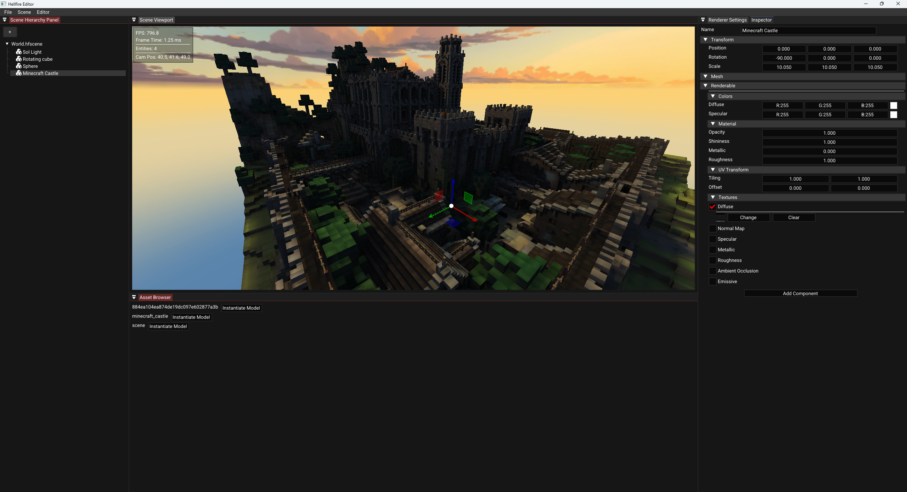

# Hellfire Game Engine 

A lightweight, experimental 3D game engine built with modern C++ and OpenGL, featuring an integrated editor and entity-component architecture.


## Features

### Rendering
- Modern OpenGL 4.3+ pipeline with custom shader support
- PBR materials with multi-texturing
- Instanced rendering for large-scale scenes
- Directional and spot lighting
- Skybox support

### Scene Management
- Entity-component system for flexible object composition
- Hierarchical scene graph with transform inheritance
- Model importing (OBJ, FBX, glTF via Assimp)
- Built-in geometry primitives

### Editor
- ImGui based interface
- Gizmo manipulation tools
- Real-time viewport preview
- Project Manager




Note: The editor is in early development and doesn't yet expose all engine features.

## Supported Platforms

Currently Windows-only with MSVC compiler support. Linux support may work with modifications but is untested.

## Building the Engine

**Prerequisites:** Windows, OpenGL 4.3+, Visual Studio 2019+, CMake 3.14+
```bash
git clone https://github.com/OriginalDCAM/hellfire.git
cd hellfire
mkdir build && cd build
cmake .. -G "Visual Studio 16 2019" -A x64
cmake --build . --config Release
```

## Quick Example
```cpp
#include "hellfire/scene/Scene.h"
#include "hellfire/graphics/Geometry/Sphere.h"

auto* scene = new hellfire::Scene("My Scene");

auto material = hellfire::MaterialBuilder::create("Sphere Material");
material->set_texture("textures/earth.jpg", hellfire::TextureType::DIFFUSE);

hellfire::EntityID sphere = hellfire::Sphere::create(scene, "Earth", {
    .material = material,
    .position = glm::vec3(0, 0, 0),
    .scale = glm::vec3(5.0f)
});
```

## Design Philosophy

Hellfire uses a composition-over-inheritance entity-component system, providing flexibility and maintainability. Entities can be composed of any combination of components at runtime, enabling data-driven scene construction and simplified serialization.

## Known Limitations

- Windows-only (currently)
- MSVC compiler required
- Editor UI incomplete
- No hot-reload for C++ scripts
- Shadows not yet implemented

## Documentation

API documentation is generated using Doxygen:
```bash
cmake --build . --target project_docs
```

## Contributing

Contributions are welcome! Fork the repository, create a feature branch, and open a pull request. Please follow existing code style and include documentation.

## License

MIT License - see LICENSE.txt for details.

## Contact

For questions or issues, visit the [Issues](https://github.com/OriginalDCAM/hellfire/issues) page.

---

**Status:** Under active development - expect breaking changes