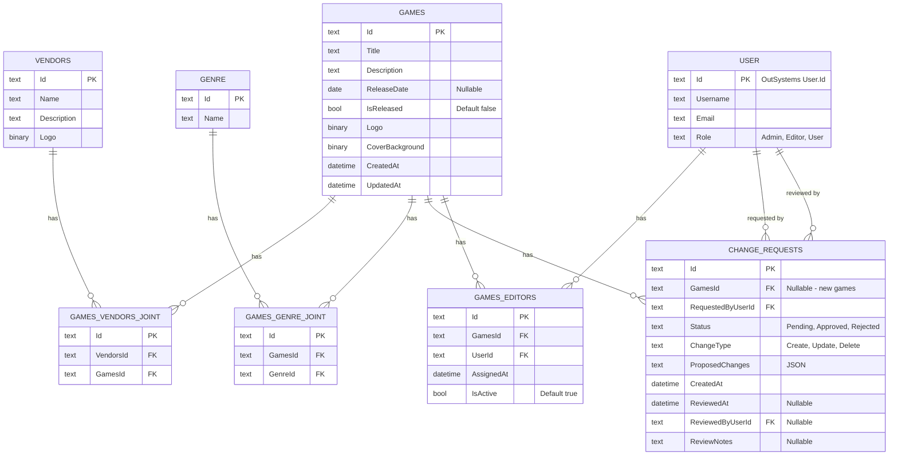

```mermaid
erDiagram
GAMES ||--o{ GAMES_VENDORS_JOINT : has
VENDORS ||--o{ GAMES_VENDORS_JOINT : has
GAMES ||--o{ GAMES_GENRE_JOINT : has
GENRE ||--o{ GAMES_GENRE_JOINT : has
GAMES ||--o{ CHANGE_REQUESTS : has
GAMES ||--o{ GAMES_EDITORS : has
USER ||--o{ GAMES_EDITORS : has
USER ||--o{ CHANGE_REQUESTS : "requested by"
USER ||--o{ CHANGE_REQUESTS : "reviewed by"

    GAMES {
        text Id PK
        text Title
        text Description
        date ReleaseDate "Nullable"
        bool IsReleased "Default false"
        binary Logo
        binary CoverBackground
        datetime CreatedAt
        datetime UpdatedAt
    }
    
    VENDORS {
        text Id PK
        text Name
        text Description
        binary Logo
    }
    
    GAMES_VENDORS_JOINT {
        text Id PK
        text VendorsId FK
        text GamesId FK
    }
    
    GENRE {
        text Id PK
        text Name
    }
    
    GAMES_GENRE_JOINT {
        text Id PK
        text GamesId FK
        text GenreId FK
    }
    
    GAMES_EDITORS {
        text Id PK
        text GamesId FK
        text UserId FK
        datetime AssignedAt
        bool IsActive "Default true"
    }
    
    USER {
        text Id PK "OutSystems User.Id"
        text Username
        text Email
        text Role "Admin, Editor, User"
    }
    
    CHANGE_REQUESTS {
        text Id PK
        text GamesId FK "Nullable - new games"
        text RequestedByUserId FK
        text Status "Pending, Approved, Rejected"
        text ChangeType "Create, Update, Delete"
        text ProposedChanges "JSON"
        datetime CreatedAt
        datetime ReviewedAt "Nullable"
        text ReviewedByUserId FK "Nullable"
        text ReviewNotes "Nullable"
    }
```